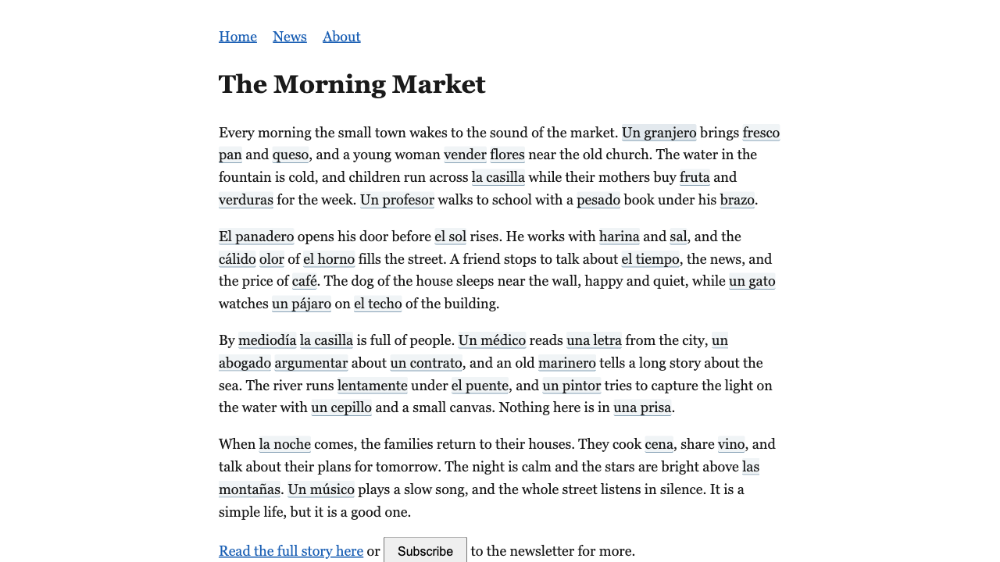
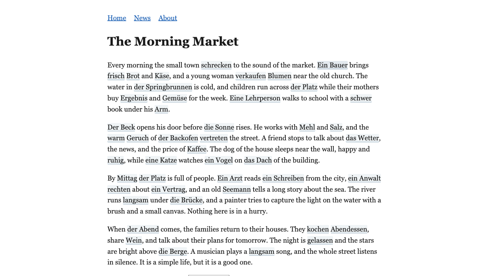
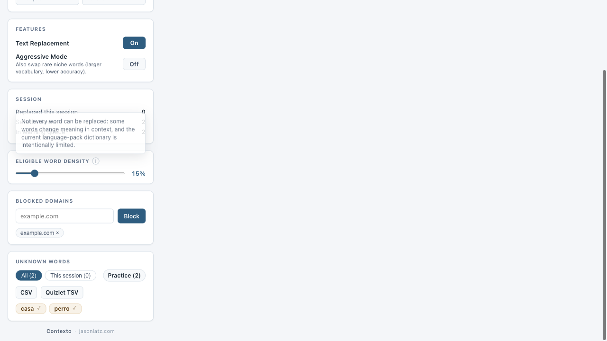

# Morning report — core-loop simplicity + fidelity

**Run:** overnight, 2026-07-06 → 07 · **Branch:** `overnight/core-loop-fidelity` · **Status:** landed on `main`

## TL;DR

The night's mission was your framing: *"just exposure to a bunch of different new words you
can click on and learn, better and higher fidelity. Simplicity is the name of the game."*
All of it shipped and is on `main`: both pretests are gone, the first run is silent, the
core loop is now covered by deterministic simulation tests, and the hover card actually
teaches grammar. On top of that, an adversarial audit of the words that really render found
a genuine data-quality problem in the **German** pack (about 71% accurate vs Spanish's 90%),
and the confirmed errors in the sample are fixed.

Nine commits, every gate green (typecheck · 118 TS tests · 32 python · build · pack
validator · 7/7 headed live run).

## What shipped

| # | Change | Commits |
|---|--------|---------|
| 1 | **Removed the auto quiz banner** and its dead machinery — reading is never interrupted | `56e19bc`, `b28c7d5` |
| 2 | **Replaced the level-picker overlay with a silent first run** — a fresh install applies intermediate defaults (density 0.15, top-1500 lemmas prepopulated) and injects on the very first page, no setup screen | `5150559`, `8b0c5ea` |
| 3 | **Deterministic core-loop simulation tests** — 6 tests drive the real pipeline through a 20-page browse; each proven non-vacuous by sabotage | `c41934a` |
| 4 | **Hover card teaches at a glance** — citation form + article ("der Bauer", "el granjero"), part of speech, irregular plural ("pl. Bauern"), cleaned glosses; write-only capture regex removed from the injection hot path | `4b6e398`, `41fc6cf` |
| 5+6 | **Rendered-band accuracy audit + fixes** — see below | `cceb33a` (es), `3df6d79` (de) |

## The headline finding: German pack quality

An adversarial audit sampled the words that actually render on real pages and had two
independent skeptic agents confirm every claimed error. Result:

- **Spanish: ~90.4%** accurate (51 confirmed errors in 530 words).
- **German: ~71.3%** accurate (172 confirmed errors in 600 words), overwhelmingly
  **wrong-sense** translations (147 of 172) — e.g. `link → Zusammenhang` where the everyday
  sense is `Link`, `state → Stand` instead of `Staat`, `office → Amt` instead of `Büro`.

This is below the 94–96% the pack was believed to be at, and it is the most important thing
to know this morning.

### What I fixed, and how conservatively

Every confirmed error in the sample was addressed by an in-place field edit (surgical text
patch, deep-equal verified so nothing else in the 50k-entry files moved):

- **Spanish:** 7 retargets to the dominant sense (`table` tabla→**mesa**, `data` dato→**datos**,
  `snack` bocadillo→**tentempié**), 39 gloss/plural refinements, 5 gated out of rendering.
- **German:** 89 retargets with correct gender + plural, 26 refinements, 57 gated (mostly
  un-renderable multi-word phrases and junk n-grams like `"make up"`, `"three people"`).

Rule of thumb applied: retarget only when both skeptics named the same single-word target
with a valid gender and plural; **otherwise gate the word out of rendering** (guaranteed to
never teach something wrong) rather than guess.

### Recommended next step (not done tonight)

The patch only covers the ~600 sampled German words. The ~29% error rate almost certainly
extends across the rest of the rendered band, so **German needs a systematic
sense-selection re-import**, not another round of hand-patching. That is the highest-value
follow-up and is scoped for a fresh session.

## The core loop, working

| Spanish immersion | German immersion | Popup review |
|---|---|---|
|  |  |  |

German nouns render capitalized with their article (`Ein Bauer`, `die Brücke`, `das Wetter`),
verbs and adjectives lowercase (`schrecken`, `frisch`, `langsam`) — the grammar the hover
card then teaches.

## Verification

- `npm run typecheck` — clean
- `npm test` — **118/118** TS tests + python **6 OK / 26 OK**
- `npm run build` — clean
- `npm run validate:language-packs` — es/de/fr/it core + tail all OK
- `node tests/live/run-live.mjs` — **7/7** headed scenarios (fresh profile: no overlay,
  replacements on first load, click-to-save round trip, popup)
- Hover cards verified live: es `Spanish · el granjero`, de `German · der Bauer · pl. Bauern`

**Not measured:** the live perf harness (`run-perf.mjs`) needs external site access that the
sandbox does not have. Perf is unaffected by these value-only pack edits (entry counts and
load paths are unchanged), and task 4 actually *removed* per-injection regex work from the
hot path, so the change is perf-neutral-to-positive. Re-run the harness on a networked
machine to get fresh numbers if you want them on record.

## Incidents worth knowing

- **Disk filled mid-run (ENOSPC).** Your volume hit 99% full (~417 GB of user data). I freed
  ~120 MB of safe ephemera and macOS purged back to ~8 GB free, but **the machine is
  critically low on space** — worth clearing out independently of this project.
- **Account session limit** paused the run once (reset 7:30am); work resumed cleanly from
  the committed state with no loss.

## Update — 4-language audit + two more improvements (2026-07-08)

A follow-up session extended the audit to **all four languages** and shipped two extension
improvements. Everything below is on `main`.

### First-ever French and Italian audits

| Pack | Sample | Accuracy | Errors fixed | Source |
|------|--------|----------|--------------|--------|
| Spanish | +240 | **100%** | 0 | FreeDict |
| German | +320 | 86.9% | 42 | Wiktextract |
| French | 400 | **84.8%** | 61 | Wiktextract |
| Italian | 400 | **84.5%** | 62 | Wiktextract |

The key discovery: **French and Italian share German's wrong-sense problem** (all ~84–87%),
while the FreeDict-based Spanish pack is 90–100%. So the defect is **systemic to the
Wiktextract gloss→word inversion**, not German-specific. 165 more confirmed errors were
fixed in place. Representative: fr `gun` canon→pistolet, `statement` communiqué→déclaration;
it `link` tramite→collegamento, `construction` struttura→costruzione; de `car park`
Garage→Parkhaus, `conditions` Auflage→Bedingung.

**Revised recommendation:** the sense-ranked re-import should cover **de + fr + it**, not
just German.

### Two fidelity improvements

1. **Popup gloss cleaning** (`a30a9f1`) — the popup chips, Practice flashcards, and exports
   now strip `#Noun`-style Wiktionary artifacts via the same `cleanGloss` as the hover card.
2. **Identical-cognate filter** (`b8884ed`) — ~1,994 non-noun entries whose target is spelled
   exactly like the English source (adjectives like `civil`, `digital`; French heaviest at
   877) are no longer injected, since showing the reader the same string teaches nothing.
   Nouns are exempt (they render with an article). Unit-tested + live 7/7.

All green: typecheck · 119 TS tests · 32 python · build · validator (es/de/fr/it).

## Everything is reversible

All work is a sequence of small, single-purpose commits on `main`. Any one — including any
individual pack fix you disagree with — can be reverted in isolation with `git revert`.
